# Upcycle - Developer Guide

## Table of contents
[Acknowledgements](#acknowledgements)
1. [Introduction](#1-introduction)
2. [Setup the environment](#2-setup-the-environment)
3. [Design](#3-design)\
   3.1. [Duke](#31-duke)\
   3.2. [Command component](#32-command-component)\
   3.3. [User component](#33-user-component)\
   3.4. [Item component](#34-item-component)\
   3.5. [Transaction component](#35-transaction-component)\
   3.6. [Ui component](#36-ui-component)\
   3.7. [Storage component](#37-storage-component)
4. [Implementation](#4-implementation)\
   4.1. [User-related features](#41-user-related-features)\
   4.2. [Item-related features](#42-item-related-features)\
   4.3. [Transaction-related features](#43-transaction-related-features)\
   4.4. [Help command](#44-help-command)\
   4.5. [Exit command](#45-exit-command)
5. [Product Scope](#5-product-scope)\
   5.1. [Target user profile](#51-target-user-profile)\
   5.2. [Value proposition](#52-value-proposition)
6. [User stories](#6-user-stories)
7. [Non-functional requirements](#7-non-functional-requirements)
8. [Glossary](#8-glossary)
9. [Instructions for manual testing](#9-instructions-for-manual-testing)

## Acknowledgements

This project is based on the skeleton code and documents of [SE-EDU AddressBook Level-3](https://se-education.org/addressbook-level3/)

## 1. Introduction

The goal of Upcycle to create a perfect desktop app dedicated to managing rental businesses. The target audience are businesses that require dealing with tons of data. It is developed for rental business managers, who can type fast to efficiently keep track of all of their customers, items, and transactions via a Command Line Interface. 
The aim of this guide is to help readers understand how the different components of Upcycle is implemented and integrated to create a functional and efficient system. The guide serves to help developers understand the architecture of Upcycle.

## 2. Setup the environment

**Step 1**: JDK 11 and IntelliJ are recommended

**Step 2**: Fork [our repo](https://github.com/AY2223S1-CS2113-W12-1/tp) and clone the fork to your local computer.

**Step 3**: Set up the JDK:
1. From the main menu, select File > Project Structure > Project Settings > Project > Project SDK
2. If ```JDK 11``` is already defined in Intellij IDEA, select it and click ```Apply```
3. If ```JDK 11``` is not defined, select Add SDK > Download JDK, choose the necessary JDK (JDK 11) and click Download, then click ```Apply```

**Step 4**: Go to File > Open, locate and open the cloned repository.

**Step 5**: Verify the setup:
1. Run ```Duke.main()``` and try some commands.
2. Run the JUnit tests in ```src/test/java/seedu.duke```

## 3. Design

This sector describes the architecture design of Upcycle with its components, and UML diagrams are used to support.

### 3.1. Duke
Duke is the main class where Upcycle will run. Upon running it, Duke calls the Ui class to greet the user, as well as the Storage class to load any existing data into the system. 
Afterwards, it repeatedly takes in user commands until the exit command is inputted by the user. Any user input is read by the Ui, returned to Duke and sent to the CommandParser class to be parsed. If the command is valid, it is sent to the Command class to be processed and sent back to Duke to be executed. Valid responses are sent to the Ui to be displayed to the user, and the data is stored in Storage. If not, an appropriate error is displayed instead.


### 3.2. Command component

From the above, it is quite clear that the Command component is important as it governs execution of behaviors depending on user input.

For our components, we try to be consistent by having an interface for classes that acts as a 'contract' to tell us what we can do with a class

We therefore have a `CommandInterface` that is implemented by an abstract class `Command`, which is the base class for all commands

Below, we show a simplified class diagram of how our Command classes are designed


A few things to take note are:

- `UserCommand`, `TransactionCommand` and `ItemCommand` are simplified here they comprise quite a number of classes
- In general, each related has a `Add`, `Remove`, `List`, `View`, `Update` command
- For example, the ItemCommand actually comprises `AddItemCommand`, `ListItemCommand`, `ViewItemCommand`, `UpdateItemCommand` and `DeleteItem` and will have other commands in the future.
- Since `Comamnd` is abstract, each subclass will have its own implementation of `executeCommand`
- `executeCommand` will either return a `Boolean` value or thrown an Exception
- The `Boolean` returned value represents if the executing command is the last executed command(such as if a user exits the program)
- `executeCommand` follows the delegation pattern. It receives `UserList`, `ItemList` and `TransactionList` which it delegates work to.

### 3.3. User component

The class diagram below shows how User-related classes interact with each other. `User` object contains `name`, `age`, `contactNumber` attributes. Users are stored in UserList, which will be loaded and written on the file by `UserStorage` (inherits from `Storage`) whenever Upcycle runs or exits.
All user-related commands operate mainly on a list of users (userList:UserList).

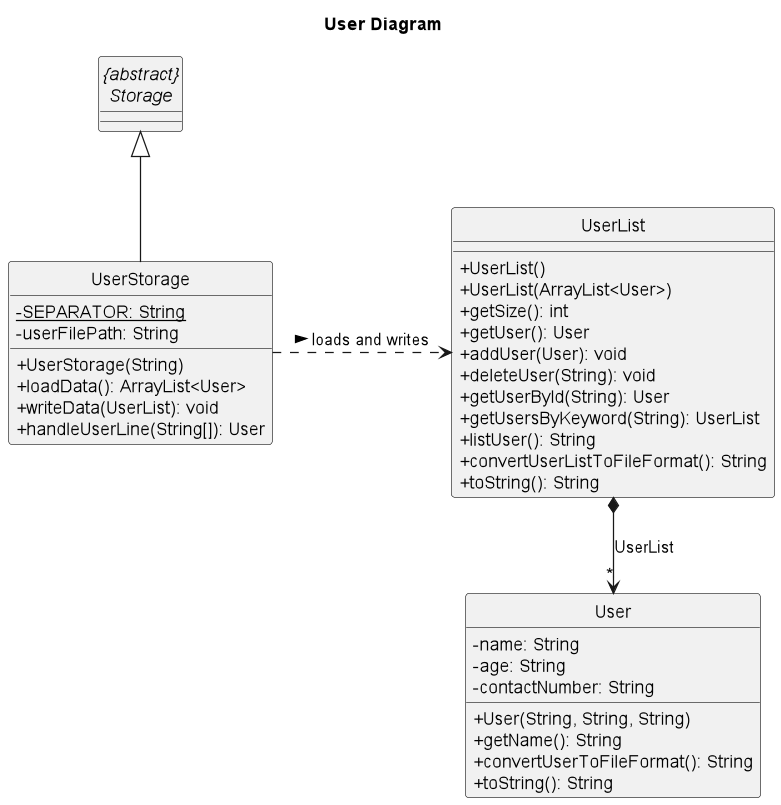

### 3.4. Item component

The Class diagram below show how Item-related classes interact with each other. `Item` object contains `itemId`, `itemName`, `ownerId`, `pricePerDay` and `category` 
attributes. Among those, `itemId` is created by `IdGenerator`'s static method to create a unique id for each item (To allow for duplicate items), and `category` is created by `Category`'s method to map the item to its specific category.
Items are stored in `itemList`, which will be loaded and written on the file by `itemStorage` (inherits from `Item`) whenever Upcycle runs or exits. All item-related 
commands operate mainly on a list of items (itemList:ItemList).
Both `item` and `itemList` classes have methods that depend on TransactionList as well for cross-checking of information between the classes.

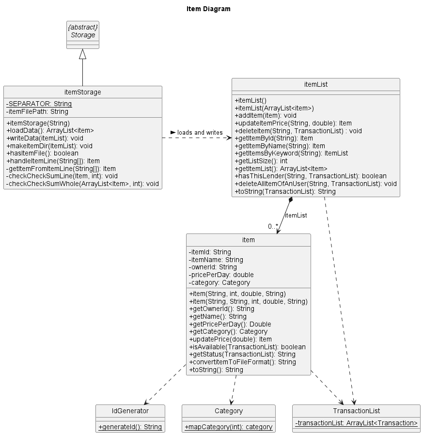

### 3.5. Transaction component

The Class diagram below show how Transaction-related classes interact with each other and theirs components. `Transaction` object contains `transactionId`, `itemName`, `itemId`, `borrower`, `duration`, `createdAt`, `returnedAt` and `moneyTransacted` 
attributes. Among those, `transactionId` is created by `IdGenerator`'s static method and dates are formatted by `DateParser`. Transactions are stored in `TransactionList`, which will be loaded and written on the file by `TransactionStorage` 
(inherits from `Storage`) whenever Upcycle runs or exits. All transaction-related commands operate mainly on a list of transaction (transactionList:TransactionList)

Some unimportant methods are ignored in this diagram, for example, some "get" methods

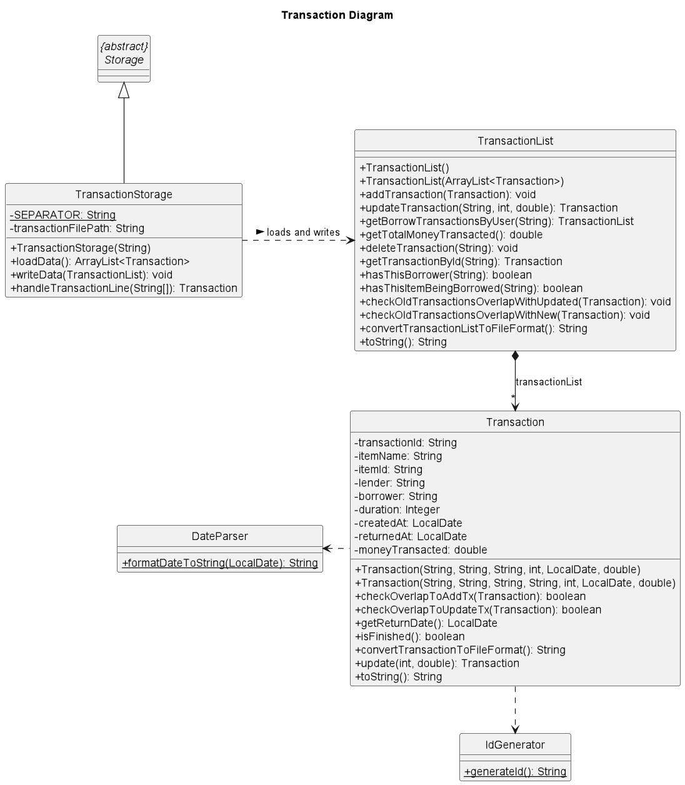

### 3.6. Ui component

The UI component handles anything related to user interaction.
Primarily, it consists of two main operations: reading user inputs and printing responses to the user.
For reading inputs, there is simply `UI::readInput`
For printing responses, there are `UI::printResponse` and `UI::printErrorResponse`
Further methods for printing specific responses that correspond to a user's behavior are defined for convenience.

The design of the UI component is to simply act as a helper class i.e. one consists mainly of static methods that is called directly from the class.
This makes sense as the UI class should not to be instantiated and is not inherited by other classes.

Below, we detail the design of the UI class with a class diagram

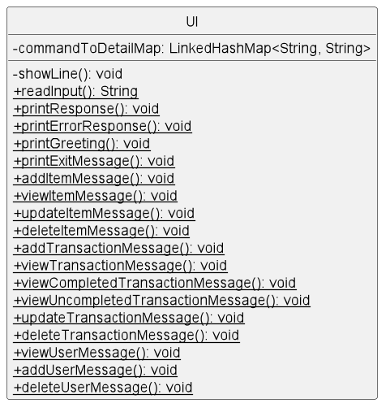


### 3.7. Storage component

Upcycle has three separate Storage class, dedicated for three types of object: ```UserStorage```, ```ItemStorage```, and ```TransactionStorage```. All of these inherit from an abstract class called ```Storage```. 
The following diagrams show more details about Storage classes: 

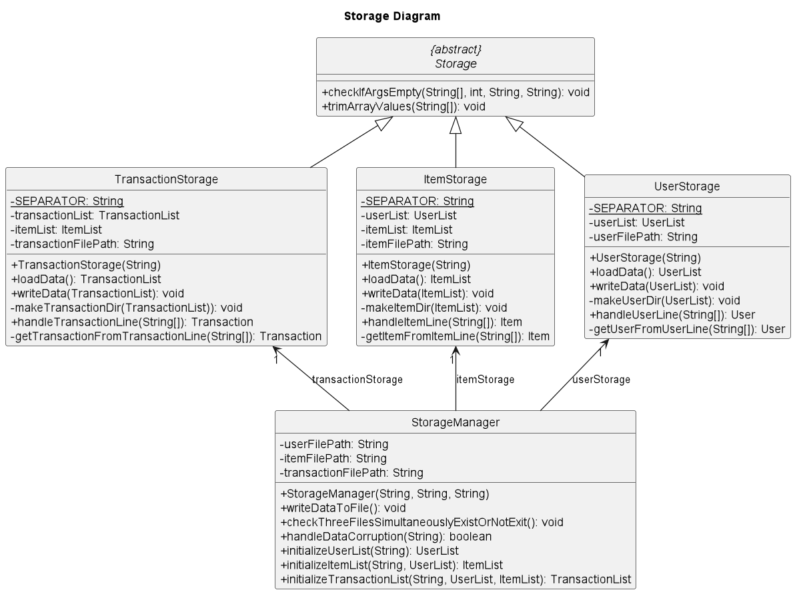

Upcycle stores the user's data, including the user list, item list, and transaction list in three files ```user.txt```, ```item.txt```, and ```transaction.txt```, respectively.
The data will be loaded when running the program and will be written to the files after each operation. These files can be found in ```data``` folder in the same directory as the folder containing project root.

If Duke detects a change the potentially cause errors in the files, it will print out where the error is and its reason. It also asks if user wants to try re-edit it or let Duke force reset all list, for example:
```
____________________________________________________________
The ITEM files has been corrupted at line 1
Reason: Category index is invalid
Please use list-categories to check the index of your chosen categories
Please try to fix your data in your files before running the app again
If you fix it correctly, you will see a greeting message in the next run
If you cannot fix it, you will see this message again. Please delete the entire data folder
to avoid errors, which also mean that all your data will be gone forever
In that case, we will create three brand-new lists for your users, items, and transactions
REMEMBER that all files in data folder must be edited correctly
Do you want to force reset all files and restart? y or n
____________________________________________________________
```

## 4. Implementation

This sector describe how features are implemented, where readers can get insight into the mechanisms of them with step-by-step descriptions and UML diagrams.
> **Note:**
> 
> ```executeCommand()``` method of every command return a boolean. Only ```ExitCommand``` returns ```true``` since it informs Duke that this is the last command to exit.

### 4.1. User-related Features

#### 4.1.1. Add a user

> This feature allows user to add a new user to their list and upon successful adding, a confirmation response about the new user will be sent from Ui to user

Given below is an example usage scenario and how the command mechanism behaves at each step.

Step 1: The user types in the command ```add-user /n [NAME] /a [AGE] /c [CONTACT]``` in the command line. The CommandParser class checks if the command is valid through the createCommand() method, and sends the input to the ```AddUserCommand``` class to be processed.

Step 2: The AddUserCommand command checks if the delimiters ('n', 'a', 'c') are present in the user input through the getArgsAddUserCmd() method. If not present, an exception will be thrown. The command also checks whether the input name, age and contact are valid through `userList.checkValidArgsForUser(args);` methods. An exception will also be thrown if the final argument does not satisfy the requirements (duplicate name, wrong range or format age, wrong contact length,...).

Step 3: If all arguments are valid, then it creates a new `User(arg[0], Integer.parseInt(args[1]), args[2])` with `args[0]` is username, `args[2]` is age, and `args[3]` is contact number

Step 4: After adding the new user, a message will be displayed to the user via `Ui.addUserMessage()` method which shows the new user's details and the size of userList.

The following sequence diagram shows how the add user operation works:


#### 4.1.2. Remove a user

> This feature allows user to remove a user to their list and upon successful removing, a confirmation response about the deleted user will be sent from Ui to user

Given below is an example usage scenario and how the command mechanism behaves at each step.

Step 1: The user types in the command ```remove-user \u [USERNAME]``` in the command line. The CommandParser class checks if the command is valid through the createCommand() method, and sends the input to the ```RemoveUserCommand``` class to be processed.

Step 2: The RemoveUserCommand command checks if the delimiter ('u') is present in the user input through the getArgsRemoveUserCmd() method. If not present, an exception will be thrown. The command also checks whether the input's final argument is valid 
(user can be deleted or not) by checking whether that user is currently borrowing or lending any item via `canDeleteUser()`, `isBorrowing()` and `isLending()` methods. An exception will also be thrown if the final argument does not satisfy the requirements (user not found, user is borrowing/lending).

Step 3: If all arguments are valid, then it finds and deletes the user in the userList by his/her name, which is unique. And all of his/her items stored in itemList are also deleted:

`userList.deleteUser(username);`

`itemList.deleteAllItemOfAnUser(username, transactionList)`

Step 4: After deleting a user, a message will be displayed to the user via `Ui.deleteUserMessage()` method which shows the deleted user's details and the size of userList.

The following sequence diagram shows how the remove user operation works:
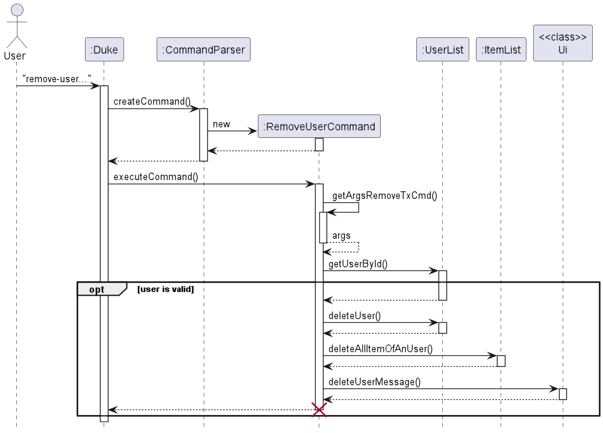

#### 4.1.3. List users

> This feature allows the user to view details of all users in the user list

Given below is an example usage scenario and how the command mechanism behaves at each step.

Step 1: The user types in the command in the command line. The CommandParser class checks if the command is valid through the createCommand() method, and either sends an exception, or send the input to the ListUsersCommand class to be processed.

Step 2: In `ListUserCommand::exeucteCommand` work is delegated `UserList::toString()` to obtain a string representation of all users in the user list

Step 3: The string representation is forwarded to `UI::printResponse` to show it to the user

Step 4: Lastly, `executeCommand` returns false to indicate that this is a non-terminating command

The following sequence diagram shows how the view user operation works:
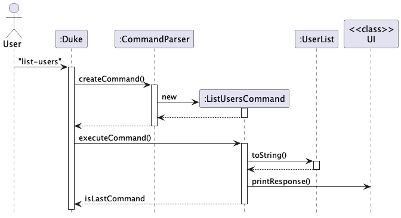

#### 4.1.4. View a user

> This feature allows the user to view a specific user in the user list. Upon successfully sending the command, the Ui will display the details of the searched user

Given below is an example usage scenario and how the command mechanism behaves at each step.

Step 1: The user types in the command in the command line. The CommandParser class checks if the command is valid through the createCommand() method, and either sends an exception, or send the input to the ViewUserCommand class to be processed.

Step 2: The ViewUserCommand command checks if the delimiters ('u') is present in the user input through the getArgsViewUserCmd() method. If not present, an exception will be thrown. The command also checks whether the input's final argument is valid (user can be found or not) by checking whether that user is currently in the user list via the `isValidUser` method. An exception will also be thrown if the final argument does not satisfy the requirements (user not found).

Step 3: If all arguments are valid, then it finds the user in the userList by his/her name, which is unique:

`userList.getUserById(userName);`.

It will also find the items belonging to the user (`ViewUserItemsCommand.getUserItems`), user's loss (`transactionList.getBorrowTransactionsByUser(userName).getTotalMoneyTransacted()`)
and user's gain (`transactionList.getLendTransactionsByUser(userName).getTotalMoneyTransacted()`)

Step 4: After finding the user, a message will be displayed to the user via `Ui.viewUserMessage()` method which show the specified user's details.

The following sequence diagram shows how the view user operation works:
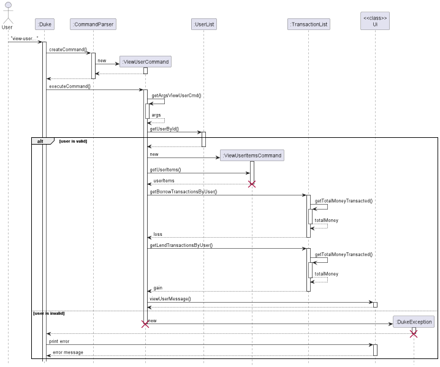

#### 4.1.5. View a user's items

> This feature is an extension to view user feature. It allows the user to view a user's items and if the input is correct, a list of items will be sent from the Ui to user

Given below is an example usage scenario and how the command mechanism behaves at each step.

Step 1: The user types in the command in the command line. The CommandParser class checks ig the command is valid through the `createCommand()` method and either sends an exception or sent the input to ViewUserItemsCommand to be processed.

Step 2: The ViewUserItemsCommand checks if the delimiters ('u') are present in the `getArgViewUserItemsCmd()`. The command checks whether the input's final argument is valid through `isValidUser()`. An exception will be thrown if the argument does not satisfy the requirements (user not found/does not exist).

Step 3: If argument is valid, then `getUserItems()` will return a list of items whose owner's id equals to the argument.

Step 4: The list of items will then be displayed to the user via `Ui.printResponse()`.

The following sequence diagram shows how the view-user-items operation works:


**...To be updated(Find user, View user debt)**

### 4.1.6. Find Users by Keyword

>This feature allows users to find items through the command ```find-user```.

Given below is an example usage scenario and how the command mechanism behaves at each step.

Step 1: The user types in the command ```find-user /u [keyword]``` in the command line. The CommandParser class checks if the command is valid through the createCommand() method.

Step 2: Duke will receive the ```FindUserCommand``` and execute it.

Step 3: FindUserCommand will check for the delimiter "/k". If it is not present, an exception is thrown. Else the command is executed.

Step 4: The UserList is iterated through to check for Users that match the provided keyword. Matched users are appended to a List which is returned and then printed by Ui.printResponse.

The following sequence diagram models the operation: PENDING DIAGRAM

### 4.1.7. View User Debt

>This feature allows users to find user debt by summing all moneyTransacted in all the Transactions in which the User is a Borrower through the command ```view-user-debt```.

Given below is an example usage scenario and how the command mechanism behaves at each step.

Step 1: The user types in the command ```view-user-debt /u [username]``` in the command line. The CommandParser class checks if the command is valid through the createCommand() method.

Step 2: Duke will receive the ```ViewUserDebtCommand``` and execute it.

Step 3: ViewUserDebtCommand will check for the delimiter "/u". If it is not present, an exception is thrown. Else the command is executed.

Step 4: The UserList is iterated through to find the User with the given [username]. If none exist, a UserNotFoundException is thrown.

Step 5: `getBorrowTransactionsByUser(username)` is run. The TransactionList is iterated through to find Transactions in which said User is the Borrower. If User is Borrower, the Transaction is added to a new TransactionList, which is then returned.

Step 6: `getTotalMoneyTransacted()` is run on the new TransactionList. The moneyTransacted in each of the Transactions in the new TransactionList is summed together to give a return value.

Step 7: The total User debt is printed by `Ui.printResponse()`.

The following sequence diagram models the operation: PENDING DIAGRAM

### 4.2. Item-related Features

#### 4.2.1. Add an item

> This feature allows user to add a new item to their list and upon successful adding, a confirmation response about the new item will be sent from Ui to user

Given below is an example usage scenario and how the command mechanism behaves at each step.

Step 1: The user types in the command ```add-item /n [NAME] /c [CATEGORY] /p [PRICE] /o [OWNER]```. The CommandParser class checks if the command is valid through the createCommand() method, and sends the input to the ```AddItemCommand``` to be processed.

Step 2: The AddItemCommand command checks if the delimiters ('n', 'c', 'p', 'o') are present in the user input through the getArgsAddItemCmd() method. If not present, an exception will be thrown. The command also checks whether the input's final argument is valid through `itemList.checkValidArgsForItem(userList, args)` methods. 
An exception will also be thrown if the final argument does not satisfy the requirements (duplicate name of item of the same owner, owner not found, wrong range and format price,...).

Step 3: If all arguments are valid, then it creates a new `Item()` with `args[0]` as itemName, `args[2]` as categoryNumber, and `args[3]` as price and `args[4]` as owner's name

Step 4: After adding the new item, a message will be displayed to the user via `Ui.addItemMessage()` method which show the new item's details and the size of itemList.

The following sequence diagram shows how the add item operation works:
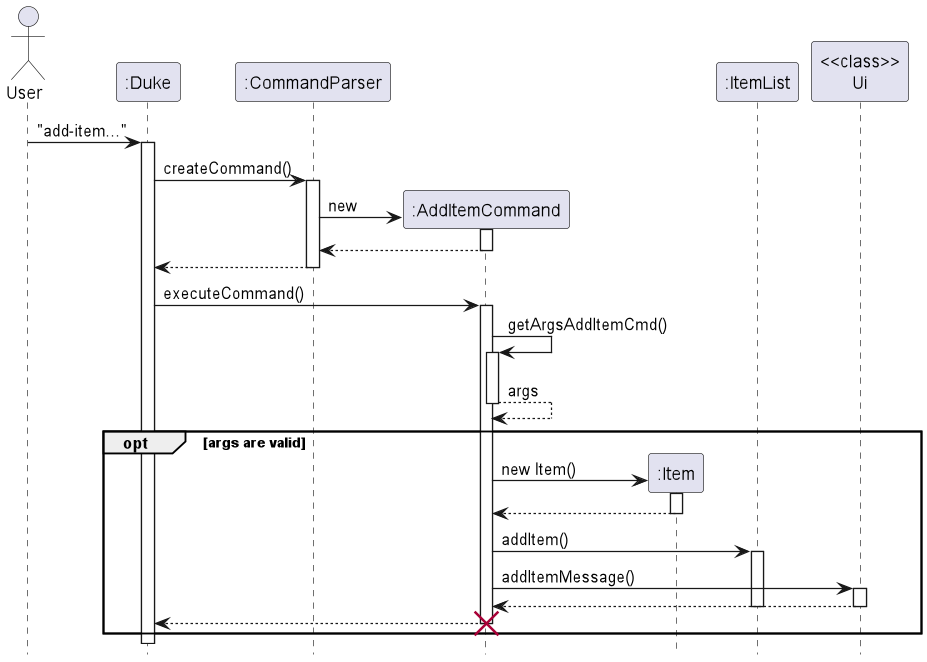

#### 4.2.2 Remove an item

> This feature allows user to remove an item to their list and upon successful removing, a confirmation response about the deleted item will be sent from Ui to user

Given below is an example usage scenario and how the command mechanism behaves at each step.

Step 1: The user types in the command ```remove-item /i [ITEMID]```. The CommandParser class checks if the command is valid through the createCommand() method, and sends the input to the RemoveItemCommand to be processed.

Step 2: The RemoveItemCommand command checks if the delimiter ('i') is present in the user input through the getArgsRemoveItemCmd() method. If not present, an exception will be thrown. The command also checks whether the input's final argument is valid (item can be deleted or not) by checking whether that item is available (not in any transaction). An exception will also be thrown if the final argument does not satisfy the requirements (item not found, item is unavailable).

Step 3: If all arguments are valid, then it finds and deletes the item in the itemList by its ID, which is unique. However, finished transactions related to that items will not be deleted since if in the future we implement "get profit" feature then it still counts those finished transactions.

`itemList.deleteItem(itemId, transactionList);`

Step 4: After deleting an item, a message will be displayed to the user via `Ui.deleteItemMessage()` method which shows the deleted item's details and the size of itemList.

The following sequence diagram shows how the remove item operation works:


#### 4.2.3. List items

> This feature allows the user to view details of all items in the item list

Given below is an example usage scenario and how the command mechanism behaves at each step.

Step 1: The user types in the command in the command line. The CommandParser class checks if the command is valid through the createCommand() method, and either sends an exception, or send the input to the ListItemsCommand class to be processed.

Step 2: In `ListItemsComamnd::exeucteCommand` work is delegated `ItemList::toString()` to obtain a string representation of all items in the item list

Step 3: The string representation is forwarded to `UI::printResponse` to show it to the user

Step 4: Lastly, `executeCommand` returns false to indicate that this is a non-terminating command

The following sequence diagram shows how the view user operation works:


#### 4.2.4. View an item

> This feature allows the user to view a specific item in the item list. Upon successfully sending the command, the Ui will display the details of the searched item

Given below is an example usage scenario and how the command mechanism behaves at each step.

Step 1: The user types in the command in the command line. The CommandParser class checks if the command is valid through the createCommand() method, and either sends an exception, or send the input to the ViewItemCommand class to be processed.

Step 2: The ViewItemCommand command checks if the delimiters ('i') is present in the user input through the getArgsViewItemCmd() method. If not present, an exception will be thrown. The command also checks whether the input's final argument is valid (item can be found or not) by checking whether that item is currently in the item list via the `isValidItem` method. An exception will also be thrown if the final argument does not satisfy the requirements (item not found).

Step 3: If all arguments are valid, then it finds the item in the itemList by itemId, which is unique:

`itemList.getItemById(itemId);`

Step 4: After finding the user, a message will be displayed to the user via `Ui.viewItemMessage()` method which show the specified user's details.

The following sequence diagram shows how the view item operation works:


#### 4.2.5. Update an item

> This feature allows the user to update a specific item in the item list

Given below is an example usage scenario and how the command mechanism behaves at each step.

Step 1: The user types in the command in the command line. The CommandParser class checks if the command is valid through the createCommand() method, and either throws an exception, or forwards the input to `UpdateItemCommand` class to be processed.

Step 2: `UpdateItemCommand::executeCommand` checks if the delimiters ('i', 'p') is present in the user input with the `getArgsViewItemCmd()` method. If any arguments are not present, an exception will be thrown.

Step 3: If all commands are present, it then checks if arguments are valid with `UpdateItemCommand::areValidArgs` . An exception will also be thrown if the final argument does not satisfy the requirements (item not found or price not valid).

Step 4: If all arguments are valid, it then delegates to `ItemList::updateItemPrice` which finds the item in the itemList by itemId, which is unique and calls `Item::updatePrice`, which returns an Item with updated price

Step 5: `ItemList` then updates itself with the latest item and returns

Step 6: Lastly, information about the updated item is printed to the user

The following sequence diagram models the operation:
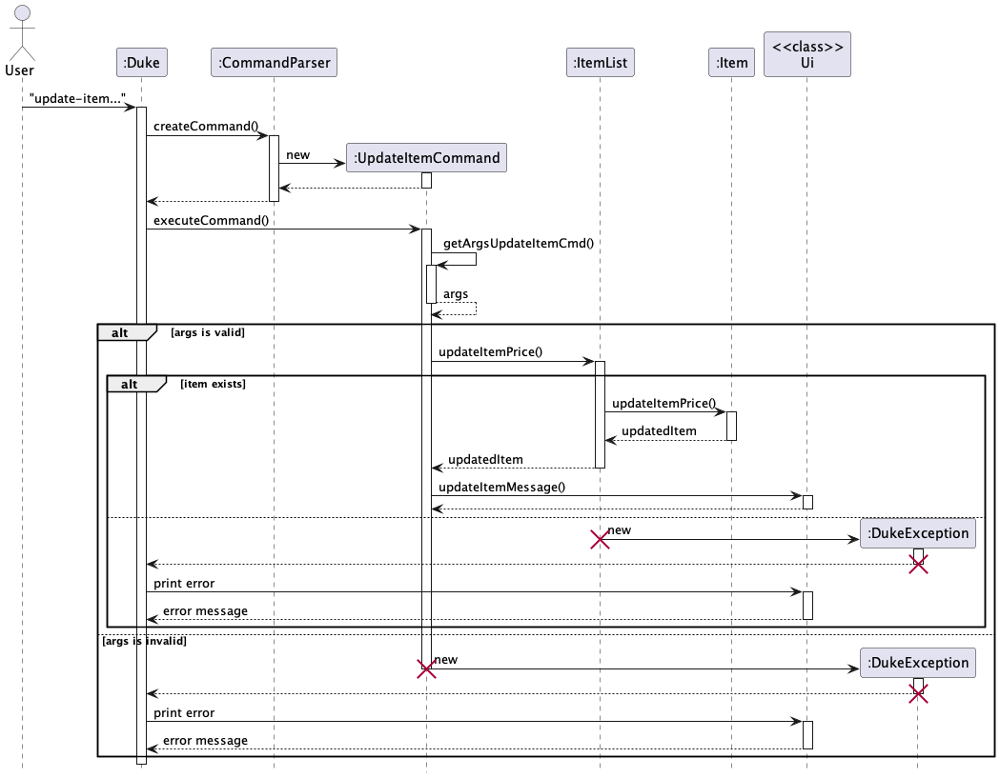

#### 4.2.6. Sorting items

> This feature allows user to sort and filter items on their list, and if the input command is correct, a list that is sorted and filtered will be sent from Ui to user

Given below is an example usage scenario and how the command mechanism behaves at each step.

Step 1: The user types in the command in the command line. The CommandParser class checks if the command is valid through the createCommand() method, and either sends an exception or send the input to the SortItemCommand to be processed.

Step 2: The SortItemCommand checks if the delimiters ('mode' (optional), 'min' (optional), 'max' (optional), 'cat' (optional)) are present in the user input through the getArgsSortItemsCmd() method. The default sorting mode is low to high if `/mode` is empty. The command checks whether the input's final argument is valid through `isValidMode()`, `isValidPrice()`, `isValidPriceBoundaries` and `isValidCategoryNumber` methods. An exception will also be thrown if the final argument does not satisfy the requirements (incorrect sort format, format price, incorrect price boundaries...)

Step 3: If all arguments are valid, then `sortAndFilter()` will return a list based on the input arguments.

Step 4: This list of items will then be displayed to the user via `Ui.printResponse()`

The following sequence diagram shows how the sort items operation works:
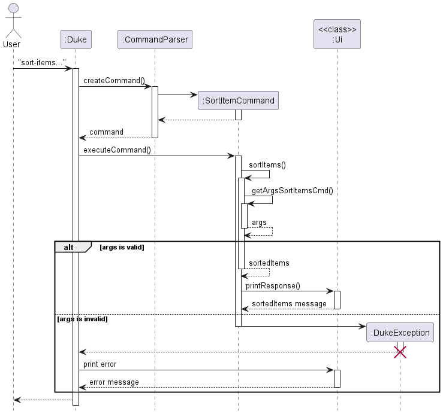

### 4.2.7. List categories

>This feature allows users to view categories that can be assigned to items and their index after executing the command ```list-categories```.

Given below is an example usage scenario and how the command mechanism behaves at each step.

Step 1: The user types in the command ```list-categories``` in the command line. The CommandParser class checks if the command is valid through the createCommand() method.

Step 2: Duke will receive the ```ListCategoriesCommand``` and execute it.

Step 3: Since there is no parameter to check for list categories command, it will execute directly by calling ```Ui.printResponse(Category.listCategories());``` (```Category.listCategories()``` returns a string represent the category list)

Step 4: The ```executeCommand()``` of ExitCommand returns false, so Duke will recognize this command is ```isLastCommand``` and exit the ```while``` loop and stop the program.

### 4.2.8. Find Items by Keyword

>This feature allows users to find items through the command ```find-item```.

Given below is an example usage scenario and how the command mechanism behaves at each step.

Step 1: The user types in the command ```find-items /k [keyword]``` in the command line. The CommandParser class checks if the command is valid through the createCommand() method.

Step 2: Duke will receive the ```FindItemsCommand``` and execute it.

Step 3: FindItemsCommand will check for the delimiter "/k". If it is not present, an exception is thrown. Else the command is executed.

Step 4: The ItemList is iterated through to check for Items that match the provided keyword. Matched items are appended to a List which is returned and then printed by Ui.printResponse.

The following sequence diagram models the operation:
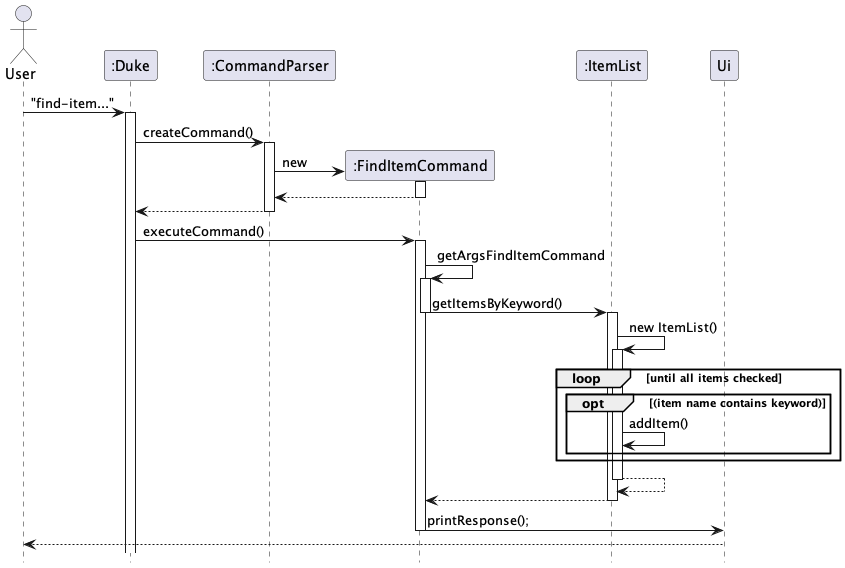

### 4.3. Transaction-related Features

#### 4.3.1. Add a Transaction

> This feature allows users to add a new transaction to their list and upon successful adding, a confirmation response about the new transaction will be sent from Ui to user

Given below is an example usage scenario and how the command mechanism behaves at each step.

Step 1: The user types in the command ```add-tx /i [ITEMID]/b [BORROWER] /d [DURATION] /c [createdDate]```. The CommandParser class checks if the command is valid through the createCommand() method, and sends the input to the AddTransactionCommand to be processed.

Step 2: The AddTransactionCommand command checks if the delimiters ('i', 'b', 'd', 'c') are present in the user input through the getArgsAddItemCmd() method. If not present, an exception will be thrown. The command also checks whether the input's final argument is valid through `checkValidInput(args)` methods. An exception will also be thrown if the final argument does not satisfy the requirements (item not found, user not found, duration wrong format, createdDate wrong format...).

Step 3: If all arguments are valid, then it creates a new `transaction()` with `args[0]` as itemId, `args[2]` as borrowerId, and `args[3]` as duration and `args[4]` as createdDate

Step 4: After adding the new transaction, a message will be displayed to the user via `Ui.addTransactionMessage()` method which shows the new transaction's details and the size of transactionList.

The following sequence diagram shows how the add transaction operation works:


#### 4.3.2. Remove a Transaction

> This feature allows user to remove a transaction to their list and upon successful removing, a confirmation response about the deleted transaction will be sent from Ui to user

Given below is an example usage scenario and how the command mechanism behaves at each step.

Step 1: The user types in the command ```remove-tx /t [TRANSACTIONID]```. The CommandParser class checks if the command is valid through the createCommand() method, and either sends an exception, or sends the input to the RemoveTransactionCommand to be processed.

Step 2: The RemoveTransactionCommand command checks if the delimiter ('t') is present in the user input through the getArgsRemoveTransactionCmd() method. If not present, an exception will be thrown. The command also checks whether the input's final argument is valid (transaction can be found). An exception will also be thrown if the final argument does not satisfy the requirements (transaction not found).

Step 3: If all arguments are valid, then it finds and deletes the transaction in the transactionList by its ID, which is unique.

`transactionList.deleteTransaction(transactionId);`

Step 4: After deleting a transaction, a message will be displayed to the user via `Ui.deleteTransactionMessage()` method which shows the deleted transaction's details and the size of transactionList.

The following sequence diagram shows how the remove transaction operation works:
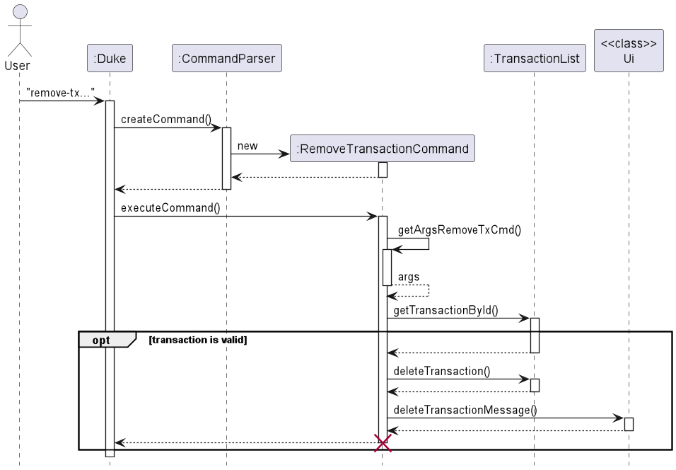

#### 4.3.3. List transactions

> This feature allows the user to view details of all transactions

Given below is an example usage scenario and how the command mechanism behaves at each step.

Step 1: The user types in the command in the command line. The CommandParser class checks if the command is valid through the createCommand() method, and either sends an exception, or send the input to the ListTransactionsCommand class to be processed.

Step 2: In `ListTransactionsCommand::exeucteCommand` work is delegated `TransactionList::toString()` to obtain a string representation of all transactions in the transaction list

Step 3: The string representation is forwarded to `UI::printResponse` to show it to the user

Step 4: Lastly, `executeCommand` returns false to indicate that this is a non-terminating command

The following sequence diagram shows how the view user operation works:
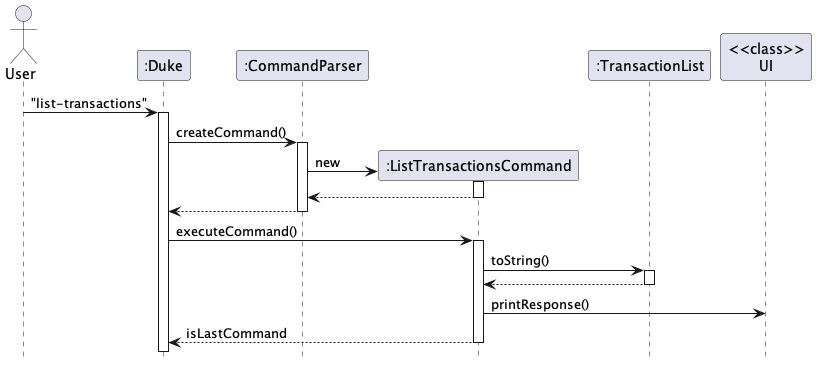

#### 4.3.4. View a transaction

> This feature allows the user to view a specific transaction in the transaction list. Upon successfully sending the command, the Ui will display the details of the searched transaction

Given below is an example usage scenario and how the command mechanism behaves at each step.

Step 1: The user types in the command in the command line. The CommandParser class checks if the command is valid through the createCommand() method, and either sends an exception, or send the input to the ViewTransactionCommand class to be processed.

Step 2: The ViewTransactionCommand command checks if the delimiters ('u') is present in the user input through the getArgsViewTransactionCmd() method. If not present, an exception will be thrown. The command also checks whether the input's final argument is valid (transaction can be found or not) by checking whether that transaction is currently in the transaction list via the `isValidTransaction` method. An exception will also be thrown if the final argument does not satisfy the requirements (transaction not found).

Step 3: If all arguments are valid, then it finds the transaction in the transactionList by transactionId, which is unique:

`transactionList.getTransactionById(transactionId)`

Step 4: After finding the transaction, a message will be displayed to the user via `Ui.viewTransactionMessage()` method which show the specified transaction's details.

The following sequence diagram shows how the view transaction operation works:
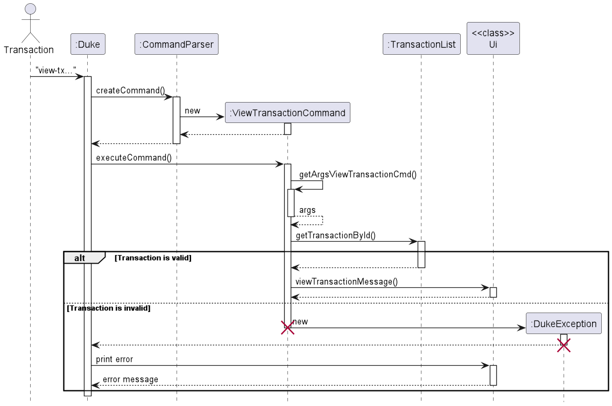

#### 4.3.5. Find Transactions By Status

> The viewTransactionsByStatus feature is facilitated by the TransactionList class. It extends the command class to add a command for users to view the history of finished or ongoing transactions for recording purposes. The feature implements the following commands:

- `find-tx /s finished`: Lists down all the transactions that have been completed.
- `find-tx /s unfinished`: Lists down all the transactions that are currently still ongoing.

Given below is an example usage scenario and how the command mechanism behaves at each step.

Step 1: The user types in the command in the command line. The CommandParser class checks if the command is valid through the createCommand() method, and either sends an exception, or send the input to the ViewTransactionsByStatus command to be processed.

Step 2: The ViewTransactionsByStatus command checks if the delimiter ('s') is present in the user input through the getArgs() method. If not present, an exception will be thrown. The command also checks whether the input's final argument is 'finished' or 'unfinished' through the isValidArgument() method. An exception will also be thrown if the final argument does not match the required words.

Step 3: Assuming the final argument is 'finish', the entire transactionList will be iterated through, and an array will store the transaction if the transaction.isFinished() status is true.

Step 4: Once the transactionList has been completely iterated through, a message will be displayed to the user via Ui.viewcompletedTransactionsMessage() which lists down all the transactions that have their isFinished() status set to true.

The following sequence diagram shows how the viewTransactionsByStatus operation works:

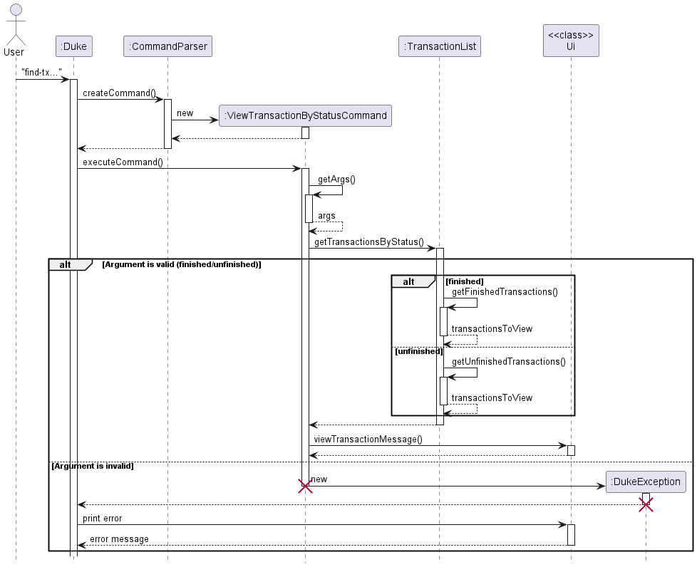

#### 4.3.6. Update an transaction

> This feature allows the user to update a specific item in the item list

Given below is an example usage scenario and how the command mechanism behaves at each step.

Step 1: The user types in the command in the command line. The CommandParser class checks if the command is valid through the createCommand() method, and either throws an exception, or forwards the input to `UpdateTransactionCommand` class to be processed.

Step 2: `UpdateTransactionCommand::executeCommand` checks if the delimiters ('t', 'd') is present in the user input with the `getArgsViewItemCmd()` method. If any arguments are not present, an exception will be thrown.

Step 3: If all commands are present, it then checks if arguments are valid with `UpdateTransactionCommand::areValidArgs` . An exception will also be thrown if the final argument does not satisfy the requirements (transaction not found or duration not valid).

Step 4: If all arguments are valid, it then delegates to `TransactionList::updateTransactionDuration` which finds the transaction in the list by `transactionId`, which is unique and calls `Transaction::updateDuration`, which returns a Transaction with updated duration

Step 5: `TransactionList` then updates itself with the latest item and returns

Step 6: Lastly, information about the updated transaction is printed to the user

The following sequence diagram models the operation:
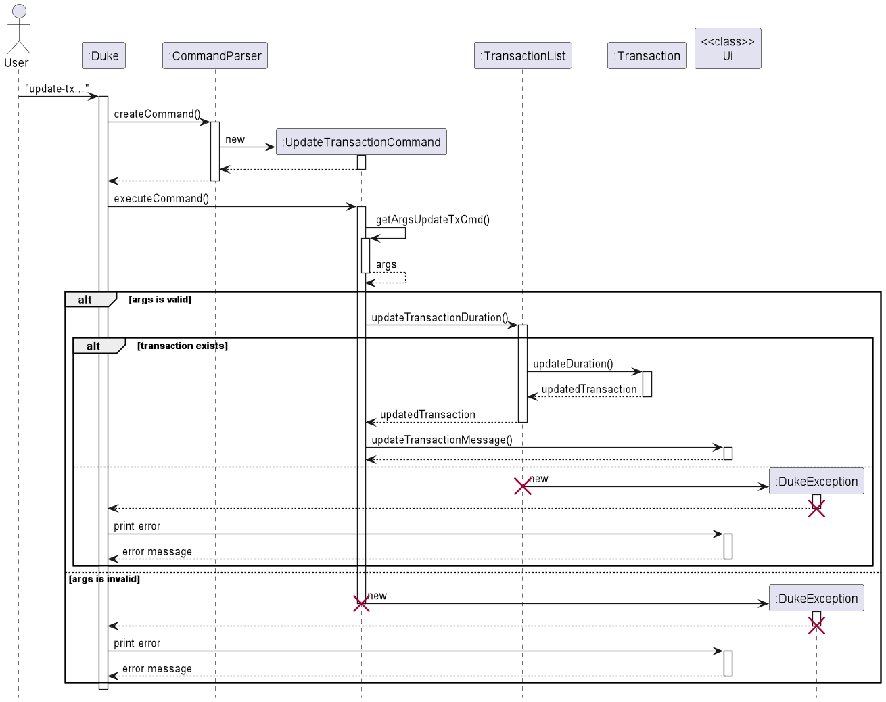


#### 4.3.7. List Transaction By User

> This feature allows the user to list all the Transactions in which a given User is a Borrower. 
> - `view-tx-by-user /u [username]`: Lists down all the transactions that have been completed.

Given below is an example usage scenario and how the command mechanism behaves at each step.

Step 1: The user types in the command in the command line. The CommandParser class checks if the command is valid through the createCommand() method, and either throws an exception, or forwards the input to `ViewTransactionsByUserCommand` class to be processed.

Step 2: `ViewTransactionsByUserCommand::executeCommand` checks if the delimiters ('u') are present in the user input with the `getArgs()` method. If argument not present, an exception will be thrown.

Step 3: If argument is present, it then checks if the User specified exists/ is valid with `ViewTransactionsByUserCommand::isValidUser` . A UserNotFoundException is thrown otherwise.

Step 4: If User is found, it then delegates to `TransactionList::getBorrowTransactionsByUser` which finds the transactions in which a given User is Borrower and returns a TransactionList containing all of them.

Step 5: The returned TransactionList printed to the User via `Ui.printResponse()`

The following sequence diagram models the operation:

### 4.4. Help Command

>This feature allows users to see all the commands and command format required by Upcycle

Usage is very simple, and is prompted when the user first opens the Upcycle application.

Step 1: Type ```help``` in the command line. A list of all relevant commands are displayed for the user's reference.

### 4.5. Exit Command

>This feature allow users to exit the program, and they will receive goodbye message after executing the command ```bye```.

Given below is an example usage scenario and how the command mechanism behaves at each step.

Step 1: The user types in the command ```bye``` in the command line. The CommandParser class checks if the command is valid through the createCommand() method.

Step 2: Duke will receive the ExitCommand and execute it.

Step 3: Since there is no parameter to check for exit command, it will execute directly by calling ```Ui.printExitMessage()```

Step 4: The ```executeCommand()``` of ExitCommand returns true, so Duke will recognize this command is ```isLastCommand``` and exit the ```while``` loop and stop the program.


## 5. Product scope

### 5.1. Target user profile

- Student at NUS
- Reasonably comfortable using CLI
- Student staying at campus
- Has a passion to serve the student community
- Student who wants to host a rental business for his/her hall
- Student who wants to help others borrow or loan items

### 5.2. Value proposition

Upcycle is a Database Management System that aims to promote frugality and sustainability by providing service for students
staying in a particular community/hall to loan or borrow items they wish to share with their community.

## 6. User Stories

| Version | As a ... | I want to ...                     | So that I can ...                                             |
|---------|----------|-----------------------------------|---------------------------------------------------------------|
| v1.0    | new user | see usage instructions            | refer to them when I forget how to use the application        |
| v1.0    | manager  | add a user                        | he/she may borrow and loan items                              |
| v1.0    | manager  | view a specific user              | know what items he/she is borrowing and loaning               |
| v1.0    | manager  | view all users                    | see who are available for loaning and borrowing               |
| v1.0    | manager  | delete a user                     | remove the user if he violates community guidelines           |
| v1.0    | manager  | add an item                       | make the item available for loan                              |
| v1.0    | manager  | delete an item                    | remove the item when a user decides not to loan it            |
| v1.0    | manager  | view a specific item              | know what the details of the item like itemID and price       |
| v1.0    | manager  | view all items                    | see what items are available/unavailable for loan             |
| v1.0    | manager  | create a transaction              | keep a record of that transaction                             |
| v1.0    | manager  | view a specific transaction       | keep track of the status of the transaction                   |
| v1.0    | manager  | delete a transaction              | remove transaction when users change their mind               |
| v2.0    | manager  | find a item by keyword            | locate an item without going through the list                 |
| v2.0    | manager  | find a user by keyword            | locate a user without going through the list                  |
| v2.0    | manager  | view transactions by status       | view the transactions that are finished or not finished       |
| v2.0    | manager  | sort items                        | view items based on its price and categories                  |
| v2.0    | manager  | update price                      | change the price a user decides to loan his item for          |
| v2.0    | manager  | update transaction                | change the number of days a user decides to loan his item for |
| v2.0    | manager  | store my database                 | maintain the database without losing my data                  |
| v2.0    | manager  | view a user's items               | view the items that belong to a user                          |
| v2.1    | manager  | view a user's borrow transactions | view the transactions in which a user is a borrower           |
| v2.1    | manager  | view a user's lend transactions   | view the transactions in which a user is a lender             |
| v2.1    | manager  | view a user's loss                | see how much a user has to pay for the items he has borrowed  |
| v2.1    | manager  | view a user's gain                | see how much a user has earned for items he has lent          |


## 7. Non-Functional Requirements

1. Should work on any mainstream OS as long as it has Java 11 or above installed.
2. A user with above average typing speed for regular English text (i.e. not code, not system admin commands) should be able to accomplish most of the tasks faster using commands than using the mouse.
3. Should work for only one user.
4. Should work without Internet connection.

## 8. Glossary

| Term          | Definition                 |
|---------------|----------------------------|
| tx            | Transaction                |
| UI            | User Interface             |
| Mainstream OS | Windows, Linux, Unix, OS-X |

...TO BE UPDATED


## 9. Instructions for manual testing

...To be updated

{Give instructions on how to do a manual product testing e.g., how to load sample data to be used for testing}
